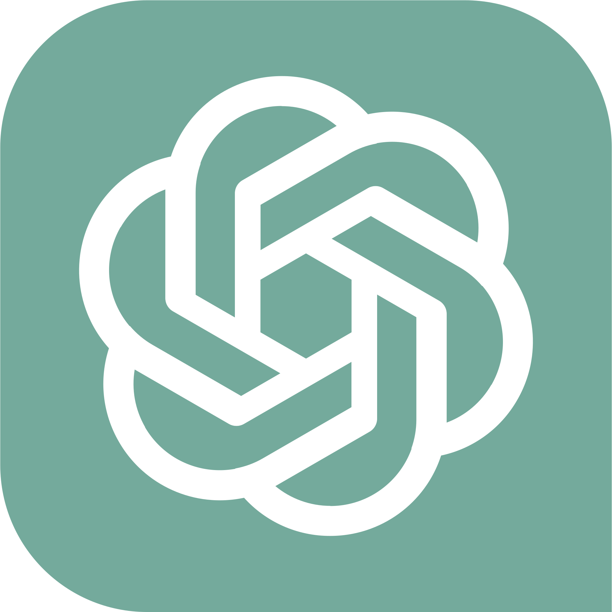
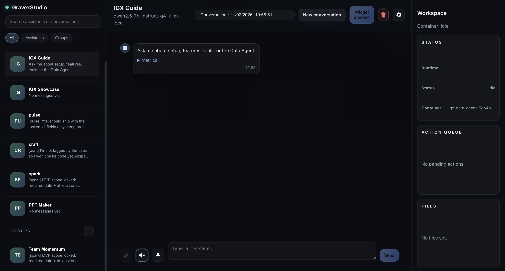
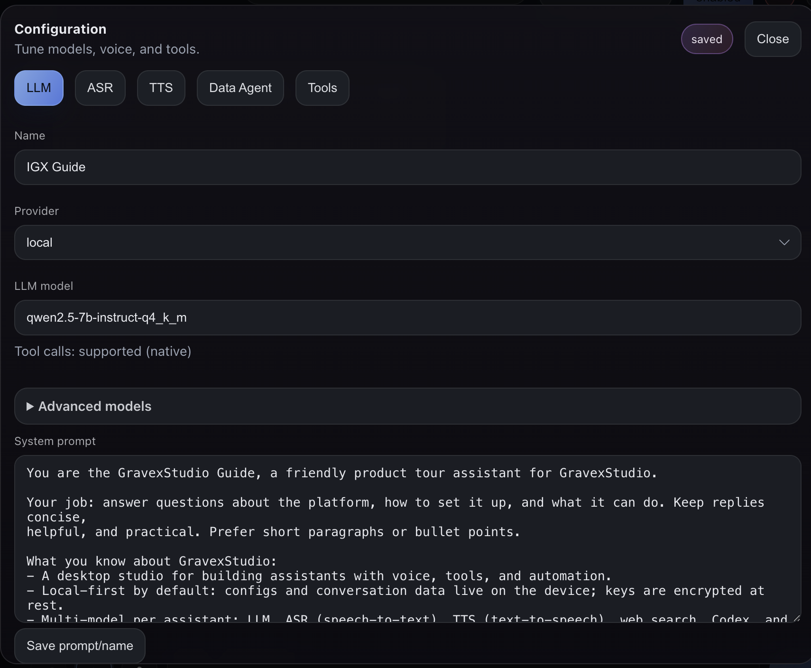
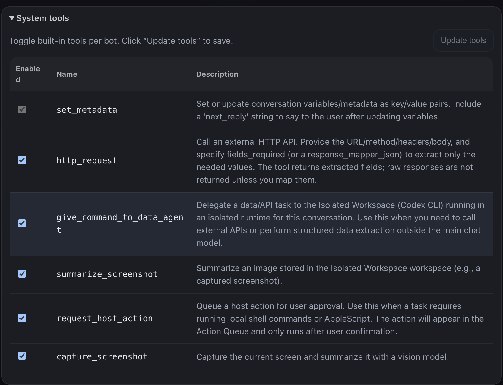
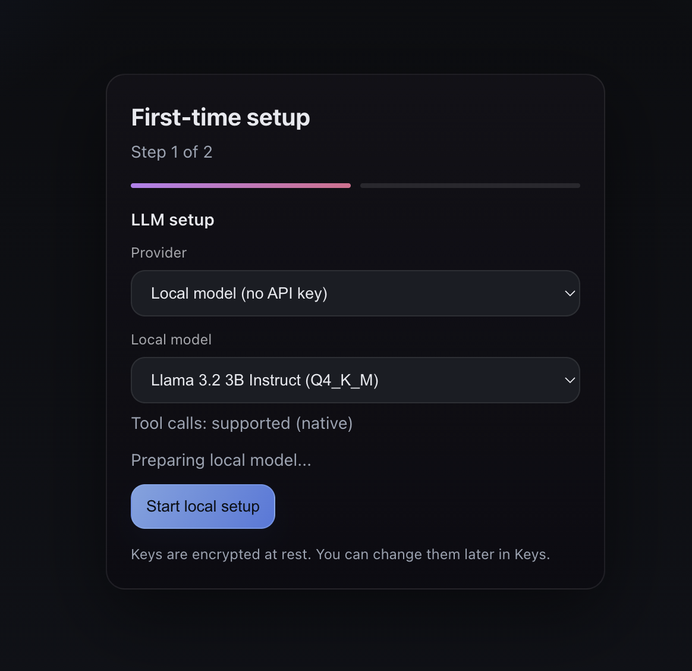

<p align="center">
  
</p>
<p align="center">
  <a href="https://gravex-agent.vercel.app">gravex-agent.vercel.app</a>
</p>

# Gravex
Run multi-agent AI workflows locally, with isolated workspaces and real tool access. No black boxes. No vendor lock-in

## How Gravex is different
- Runs agents on *your* machine, not someone else’s cloud
- One agent = one isolated workspace (no collisions)
- Real tools (Git, Jira, DBs), not just chat
- Built-in scheduled jobs (daily/weekly/once) that run in the same conversation context
- Works with local LLMs *or* OpenAI
- Has Visual studio integrated in it, so you literally dont have to switch screens. Do everything in one place!
  
## Who is Gravex for?
- Engineers handling multiple Jira tickets daily
- Founders who want AI agents without leaking code or data
- Teams experimenting with multi-agent workflows locally
- Power users tired of SaaS copilots with zero control

  
## How do i use it?
- Made an agent by using the Studio and gave it access to gmail, github, jira, gitlab, databases.
- Logged in with my Openai account so no need of key if i have to use smaller models, else i provide my key.
- For my day to day tasks: It spins up multiple agents and I give each ticker Jira ticket links, that's it. If the description is sufficient,
- It clones the repo in isolated workspaces (docker container), does  the work and just gives me URLs to test.
- The Multi - Agent framework never collide with each other as its in seperate Docker Container.
- I have visual Studio Code integrated, so i can just take a look at the code, write code manually there too, all in the same screen.
- This is just one of the infinite use cases.
- Others for fun: I just spin up agent swarm and let them collab and come up with the code/test/reviews after i give them a task
- For repeat work: I can just say schedule this everyday at X time and it auto-runs with the same assistant + tools.
  
Gravex gives you a dashboard to create agents, run real tasks, and keep files, configs, and context on-device. Use local LLMs or OpenAI, add tools, and scale from one agent to teams.

## Integrations

<table>
  <tr>
    <td align="center"><br/>OpenAI</td>
    <td align="center"><br/>GitHub</td>
    <td align="center"><br/>GitLab</td>
    <td align="center"><br/>Jira</td>
    <td align="center"><br/>Gmail</td>
    <td align="center"><br/>Database</td>
    <td align="center"><br/>Slack</td>
    <td align="center"><br/>VS Code</td>
  </tr>
</table>

## Default Assistants

- **GravexStudio Guide** (system helper)
- **IGX Showcase** (demo agent)

## Run Locally

- Docker is only required for Isolated Workspaces.
- Download Docker Desktop for full features (Isolated Workspaces): https://www.docker.com/products/docker-desktop/
- Local models download automatically when selected.

> The dashboard works on macOS, Linux, and Windows.

```bash
./start.sh web -v
```
This command builds the Studio UI first, then starts the web server.

Windows options:
- Git Bash: `./start.sh web -v`
- PowerShell:

```powershell
py -3.11 -m venv .venv
.\.venv\Scripts\python.exe -m pip install -U pip setuptools wheel
.\.venv\Scripts\python.exe -m pip install -e ".[web]"
.\.venv\Scripts\python.exe -m voicebot web -v
```

Open:
- `http://localhost:7621/dashboard`

Isolated Workspace ports:
- Default published host-port range is `7000-7100`.
- Configure range with `IGX_DATA_AGENT_PORT_RANGE` (or `VOICEBOT_DATA_AGENT_PORT_RANGE`), for example: `7000-7100`.
- Configure per-container allocation with `IGX_DATA_AGENT_PORTS_PER_CONTAINER` (or `VOICEBOT_DATA_AGENT_PORTS_PER_CONTAINER`).
- The Developer panel now shows exact per-container mappings (`host->container`) and marks the IDE port.
- If you see `No available Isolated Workspace ports`, stop old containers from the Developer panel to release ports.

macOS auto-start (optional):
- Install at login/restart:

```bash
./scripts/install_macos_autostart.sh
```

- If you stop port `7621` by mistake, restart the service:

```bash
launchctl kickstart -k gui/$(id -u)/com.intelligravex.voicebot.web
```

- Disable auto-start:

```bash
./scripts/uninstall_macos_autostart.sh
```

First‑time setup in the UI:
- Choose **ChatGPT (OAuth)**, **Local**, **OpenAI**, or **OpenRouter**.
- Voice (ASR/TTS) is optional.
- Isolated Workspace is optional and requires Docker.
- For Local models, you can pick a bundled model or use **Custom URL** to provide a direct download link.
 - The Isolated Workspace image is built locally on first use (or run `./scripts/build_data_agent_image.sh`).
- Set up **Connected apps** if needed (GitHub, GitLab, Jira, Gmail OAuth, Slack OAuth, DB credentials).
- VS Code is integrated inside the dashboard via the **IDE (VS CODE)** panel for each workspace.

## Scheduled Jobs (Automations)

Use natural language to schedule recurring or one-time assistant tasks in the same conversation context.

Examples:
- `In 10 minutes remind me to get shampoo.`
- `Every day at 5 PM IST, send me 5 AI headlines on email.`
- `Every weekday at 09:00 UTC summarize my pending tasks.`

Job management examples:
- `What jobs are there?`
- `Disable all jobs for this conversation.`
- `Update job <job_id> to run daily at 08:30 UTC.`
- `Delete job <job_id>.`

Notes:
- Times are normalized and stored in **UTC**.
- Jobs run with the same assistant + conversation context/toolchain.
- You can also view and edit jobs from the **Jobs** tab in assistant settings.

## Why Local‑First

- Your data stays on your machine by default.
- Local models work without API keys.
- You control what each agent can access.

## Features

- Dedicated dashboard to spin up agents and teams fast.
- Local LLM runtime with **0 API keys** and **0 data export**.
- ChatGPT OAuth sign‑in for instant GPT access (no API key copy‑paste).
- Summarization to keep context stable with less drift.
- System tools with 1‑click enablement and approvals.
- HTTP request tool (ad‑hoc) for zero‑setup API calls.
- Integration tools + response mapper for schema‑driven APIs.
- Codex post‑processing for cleaner structured outputs.
- Scheduled jobs with conversation-aware automation + CRUD controls.
- Isolated Workspaces per agent (optional, Docker).
- Integrated VS Code panel inside the workspace for quick review/edits.
- Local or OpenAI models for chat and automation.
- Connected apps hub for GitHub/GitLab, Jira, Gmail OAuth, Slack OAuth, and database profiles.

## Screenshots






## Desktop Build (Optional)

```bash
./scripts/package_macos.sh
```

```bash
./scripts/package_linux_appimage.sh
```

```powershell
.\scripts\package_windows.ps1
```

Outputs:
- macOS: `dist/GravexStudio.app`
- Linux: `dist/GravexStudio-x86_64.AppImage`
- Windows: `dist/GravexStudio.exe`
